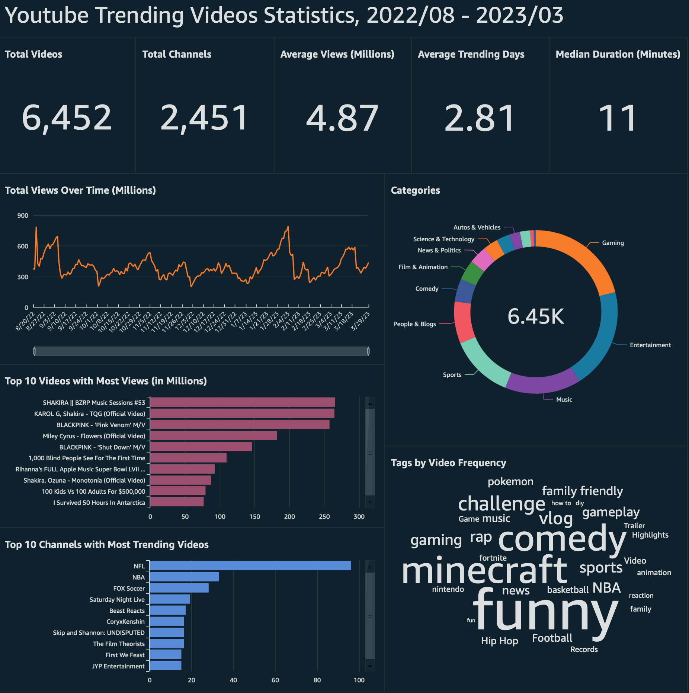

# YouTube Trending Videos ETL Pipeline

## TABLE OF CONTENTS

* [Introduction](#introduction)
* [Pipeline Architecture](#pipeline-architecture)
* [Database Diagrams](#database-diagrams)
* [Data analysis using SQL](#data-analysis-using-sql)
* [Reference Links](#reference-links)

## Introduction

This project is an serverless ETL pipeline that extracts data from the YouTube Data API, transforms it, and loads it into a AWS RDS MySQL database. The pipeline is triggered daily using AWS Lambda.

In the end, an AWS QuickSight dashboard is created for data visualization:

  

## Pipeline Architecture

The architecture of the pipeline is as follows:

- A Lambda function is deployed using a Docker container image, and triggered daily using Amazon EventBridge event schedule.
- The Lambda function is responsible for querying the YouTube Data API and transforming the data.
- The transformed data is then loaded into a MySQL database.

  

## Database Diagrams

- `trending_record`: Stores records of trending videos, where new records will be inserted daily
- `trending_video`: Stores attributes of trending videos. Insert new data if the video doesn't exist, otherwise update the corresponding row
- `trending_channel`: Stores attributes of channels of trending videos. Insert new data if the channel doesn't exist, otherwise update the corresponding row

  

## Data Analysis using SQL

We can run various queries and analyses to gain deeper insights and make data-driven decisions, for example:
- Descriptive statistics: the top number of trending videos, channels, median duration, average days in trending, etc.
- Top N videos/categories/tags
- Trends of popularity

Please check [data analysis using SQL]() for details.

## Reference Links

- [Youtube Data API Overview](https://developers.google.com/youtube/v3/docs)
- [Create and Connect to a MySQL Database with Amazon RDS](https://aws.amazon.com/getting-started/hands-on/create-mysql-db/)
- [Creating Lambda container images](https://docs.aws.amazon.com/lambda/latest/dg/images-create.html)

